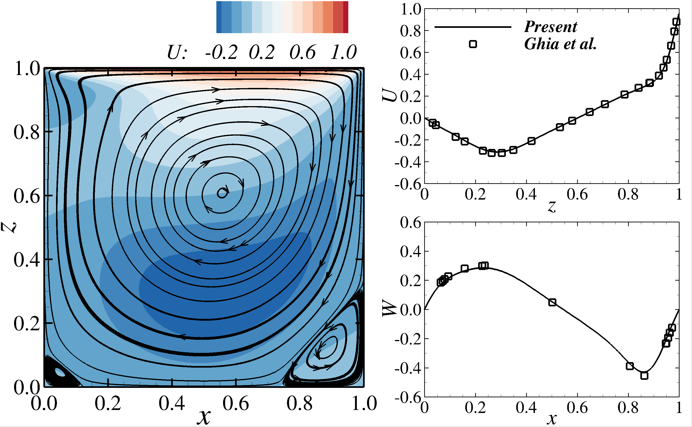

# Cavity

The cavity is the first benchmark and the easiest simulation to run for beginners as it does not entail any geometry, scalar, free surface or particles. The cavity is best to understand the boundary condition of the code and grab first-hand experience running Hydro3D and using Tecplot.&#x20;

<mark style="color:red;">**Prerequisite:**</mark> <mark style="color:red;"></mark> Considers that you are in a docker container or that OneAPI Intel is installed on your computer.

<figure><figcaption></figcaption></figure>

### Compile & copy hydro3D executable into the cavity benchmark folder:

```
cd Benchmarks
cd src_v70 (src_2023 if trying with the newest version)
make -j
cp 3dFDM.exe ../Benchmark1_Cavity
cd ../Benchmark1_Cavity
```

### **Run the simulation and Monitor the simulation:**

```
mpirun -np 8 ./3dFDM.exe     # Start the simulation

In a new window:
tail -f worktime.dat         # Shows you the time that each section of the code takes
tail -f rms.dat              # Shows you the mass deficit of the simulation
htop                         # Shows you the ram and cpu usage of the simulation
```

### Analyse the data (TECPLOT):

```
tec360 LAYOUT_Cavity.lay
```

### Analyse the data (Paraview):

```
# Compile the code to adapt the Tecplot output into Paraview data files:
ifort TECPLOT_TO_PARAVIEW.f90 -o TECPLOT_TO_PARAVIEW.exe

# Run the code:
./TECPLOT_TO_PARAVIEW.exe

# Open the Paraview state:
paraview STATE_Cavity.pvsm
```
